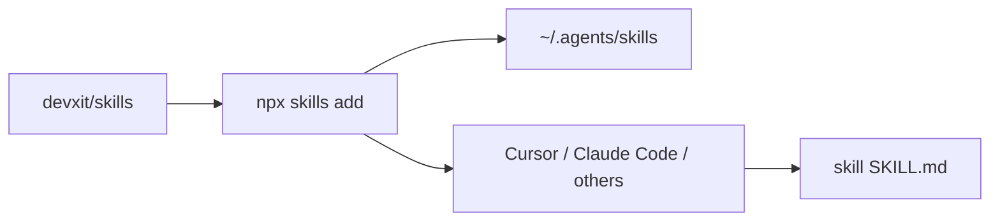

# skills

[🇺🇸](README.md) [🇧🇷](README.pt-BR.md)

Catalog of [Agent Skills](https://agentskills.io/specification) from [DEVX IT](https://github.com/devxit) for Cursor, Claude Code, and other compatible agents.

---

## Table of Contents

- [About](#about)
- [Features](#features)
- [Tech Stack](#tech-stack)
- [Architecture](#architecture)
- [Project Structure](#project-structure)
- [Getting Started](#getting-started)
- [Configuration](#configuration)
- [Security](#security)
- [How to Contribute?](#how-to-contribute)
- [What's Next?](#whats-next)
- [License](#license)
- [Acknowledgements](#acknowledgements)
- [Author](#author)

---

## About

This repository is a catalog of reusable Agent Skills: each folder has a `SKILL.md` (plus references/scripts when needed) so agents follow a consistent workflow.

It is for teams and individuals who want ready-made capabilities (structured READMEs, Graphify, and so on) without copying prompts into every project.

## Features

| Skill | Version | Description |
|-------|---------|-------------|
| [`readme-pls`](readme-pls/) | **1.3.0** | Create, edit, and review READMEs with a 15-section guide, security rules, inferred-data confirmation, MIT, extra locales in `README.<locale>.md` with flag links, and a prompt to sync sibling locale files after edits |
| [`graphify-me`](graphify-me/) | **1.2.0** | Install and configure [Graphify](https://github.com/Graphify-Labs/graphify) in a project, with optional Obsidian export |
| [`jira-sync`](jira-sync/) | **1.0.0** | Sync JIRA with repo mirrors via `.jira/` harness config; consolidate duplicates without information loss |

Install globally with the `npx skills` CLI (recommended). `graphify-me` also ships Python install scripts.

## Tech Stack

- Markdown + Agent Skills frontmatter (`SKILL.md`)
- [Skills CLI](https://github.com/vercel-labs/skills) (`npx skills`)
- Python 3.10+ only for `graphify-me` (`install.py` and scripts under `graphify-me/scripts/`)

There is no application runtime or root `package.json`: this repo is documentation plus skill packages.

## Architecture



Once installed, a skill is loaded when the user request matches the `description` in `SKILL.md`.

## Project Structure

```
.
├── LICENSE                 # MIT (DEVX IT) — catalog
├── README.md               # English
├── README.pt-BR.md         # Portuguese
├── readme-pls/             # README skill
│   ├── LICENSE             # MIT
│   ├── SKILL.md
│   └── references/
├── graphify-me/            # Graphify skill
│   ├── LICENSE             # MIT
│   ├── SKILL.md
│   ├── README.md
│   ├── install.py
│   ├── references/
│   └── scripts/
└── jira-sync/              # JIRA sync skill
    ├── LICENSE
    ├── SKILL.md
    ├── README.md
    └── references/
        ├── bootstrap/      # copy → .jira/ in target project
        └── dot-jira-layout.md
```

Every skill package sits **one level** below the repo root (`<skill>/SKILL.md`), which is what the `skills` CLI scans by default. Nesting a package deeper (e.g. `graphify-me/graphify-me/SKILL.md`) hides it from `npx skills add` unless you pass `--full-depth`.

Per-skill depth lives in each `SKILL.md` / nested README. This file is the catalog entry point.

## Getting Started

### Prerequisites

- Git
- Node.js (for `npx skills`)
- Python 3.10+ only if you use the `graphify-me` Python installer

### Setup

```bash
git clone https://github.com/devxit/skills.git
cd skills
```

Install skills **globally** (available in every project):

```bash
npx skills add . --skill readme-pls -g -y
npx skills add . --skill graphify-me -g -y
```

List skills in this repo:

```bash
npx skills add . --list
```

Without cloning, from GitHub:

```bash
npx skills add devxit/skills --skill readme-pls -g -y
npx skills add devxit/skills --skill graphify-me -g -y
npx skills add devxit/skills --skill jira-sync -g -y
```

### Verify

In your agent (Cursor, Claude Code, etc.), ask for something the skill covers, for example:

- “generate the README” → should follow `readme-pls`
- “install graphify in this project” → should follow `graphify-me`

`graphify-me` does **not** wire Graphify into this catalog repo; that happens in a **target project**. Full guide: [`graphify-me/README.md`](graphify-me/README.md).

After pulling skill updates, reinstall globally so agents load the new `SKILL.md` (e.g. `readme-pls` **1.3.0**):

```bash
npx skills add . --skill readme-pls -g -y
npx skills add . --skill graphify-me -g -y
```

## Configuration

This repository has no environment variables. Do not copy `.env` files or secrets into skills or READMEs.

`npx skills` flags (`-g`, `-a`, `-y`) are documented in the [Skills CLI](https://github.com/vercel-labs/skills).

## Security

- Skills and docs must **not** contain secrets, tokens, passwords, or `.env` contents
- `graphify-me` and `readme-pls` forbid reading `.env` to fill documentation
- Report vulnerabilities via [GitHub issues](https://github.com/devxit/skills/issues) (never paste secrets)

## How to Contribute?

1. Fork [devxit/skills](https://github.com/devxit/skills)
2. Branch from `main` (`feat/skill-name` or `fix/...`)
3. Add or update the skill folder (`SKILL.md` + references); do not duplicate per-agent trees
4. Open a pull request describing the expected agent behavior

Keep the skill package as the single source of truth; agent install is handled by `npx skills` or each package’s scripts.

## What's Next?

- Add more skills to this catalog as they are standardized
- Keep `graphify-me` aligned with upstream Graphify CLI

## License

MIT (DEVX IT) for this catalog and every skill — see [LICENSE](LICENSE). Each skill package also ships the same text: [readme-pls/LICENSE](readme-pls/LICENSE), [graphify-me/LICENSE](graphify-me/LICENSE). `SKILL.md` frontmatter uses `license: MIT`.

## Acknowledgements

- [15 Essential Sections Every README Needs](https://dev.to/georgekobaidze/15-essential-sections-every-readme-needs-give-your-project-what-it-deserves-fie) (Giorgi Kobaidze) — basis for `readme-pls`
- [Graphify](https://github.com/Graphify-Labs/graphify) and [Agent Skills](https://agentskills.io/home)
- [Skills CLI](https://github.com/vercel-labs/skills)

## Author

**DEVX IT** — [github.com/devxit](https://github.com/devxit)
