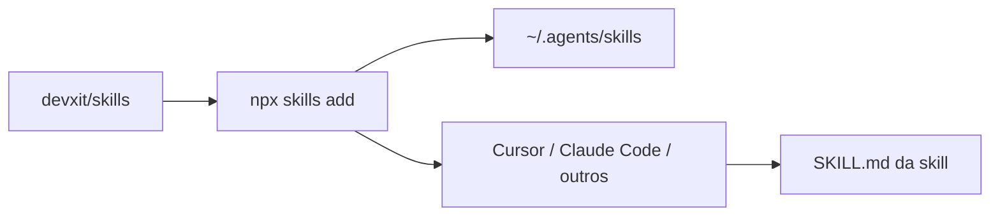

# skills

[🇺🇸](README.md) [🇧🇷](README.pt-BR.md)

Catálogo de [Agent Skills](https://agentskills.io/specification) da [DEVX IT](https://github.com/devxit) para Cursor, Claude Code e outros agentes compatíveis.

---

## Sumário

- [Sobre](#sobre)
- [Funcionalidades](#funcionalidades)
- [Stack](#stack)
- [Arquitetura](#arquitetura)
- [Estrutura do projeto](#estrutura-do-projeto)
- [Como começar](#como-começar)
- [Configuração](#configuração)
- [Segurança](#segurança)
- [Como contribuir?](#como-contribuir)
- [Próximos passos](#próximos-passos)
- [Licença](#licença)
- [Agradecimentos](#agradecimentos)
- [Autor](#autor)

---

## Sobre

Este repositório reúne skills reutilizáveis no formato Agent Skills: cada pasta contém um `SKILL.md` (e referências/scripts quando necessário) para o agente seguir um fluxo de forma consistente.

O público são times e pessoas que usam agentes de código e querem instalar capacidades prontas (README estruturado, Graphify, etc.) sem copiar instruções à mão em cada projeto.

## Funcionalidades

| Skill | Descrição |
|-------|-----------|
| [`readme-pls`](readme-pls/) | Cria, edita e revisa README com 15 seções, regras de segurança e confirmação de dados inferidos |
| [`graphify-me`](graphify-me/) | Instala e configura [Graphify](https://github.com/Graphify-Labs/graphify) no projeto, com export opcional para Obsidian |

Instalação global via CLI `npx skills` (recomendado) ou, no caso do `graphify-me`, também via scripts Python do próprio pacote.

## Stack

- Markdown + frontmatter Agent Skills (`SKILL.md`)
- [Skills CLI](https://github.com/vercel-labs/skills) (`npx skills`)
- Python 3.10+ apenas para `graphify-me` (`install.py` e scripts em `graphify-me/graphify-me/scripts/`)

Não há runtime de aplicação nem `package.json` na raiz: o catálogo é documentação e pacotes de skill.

## Arquitetura



Uma skill instalada vira instrução que o agente carrega quando o pedido do usuário combina com a `description` do `SKILL.md`.

## Estrutura do projeto

```
.
├── LICENSE                 # MIT (DEVX IT) — catálogo
├── README.md               # inglês
├── README.pt-BR.md         # português
├── readme-pls/             # skill de README
│   ├── LICENSE             # MIT
│   ├── SKILL.md
│   └── references/
└── graphify-me/            # skill + instalador Graphify
    ├── README.md
    ├── install.py
    └── graphify-me/        # pacote canônico (fonte única)
        └── LICENSE         # MIT
```

Detalhes de cada skill ficam no respectivo `SKILL.md` / README interno — este arquivo é só o ponto de entrada do catálogo em português.

## Como começar

### Pré-requisitos

- Git
- Node.js (para `npx skills`)
- Python 3.10+ apenas se for usar o instalador Python do `graphify-me`

### Setup

```bash
git clone https://github.com/devxit/skills.git
cd skills
```

Instalar skills **globalmente** (disponíveis em qualquer projeto):

```bash
npx skills add . --skill readme-pls -g -y
npx skills add . --skill graphify-me -g -y
```

Listar skills deste repositório:

```bash
npx skills add . --list
```

Sem clonar, a partir do GitHub:

```bash
npx skills add devxit/skills --skill readme-pls -g -y
npx skills add devxit/skills --skill graphify-me -g -y
```

### Verificar

No agente (Cursor, Claude Code, etc.), peça algo coberto pela skill, por exemplo:

- “gere o README” → deve seguir `readme-pls`
- “instala graphify neste projeto” → deve seguir `graphify-me`

O `graphify-me` ainda **não** configura Graphify no catálogo em si; isso acontece no **projeto alvo**. Guia completo: [`graphify-me/README.md`](graphify-me/README.md).

## Configuração

Não há variáveis de ambiente neste repositório. Não copie `.env` nem secrets para skills ou README.

Opções do `npx skills` (`-g`, `-a`, `-y`) estão na [Skills CLI](https://github.com/vercel-labs/skills).

## Segurança

- Skills e documentação **não** devem conter secrets, tokens, senhas ou conteúdo de `.env`
- `graphify-me` e `readme-pls` proíbem leitura de `.env` para preencher docs
- Relate vulnerabilidades por [issues](https://github.com/devxit/skills/issues) no GitHub (sem colar secrets)

## Como contribuir?

1. Faça fork de [devxit/skills](https://github.com/devxit/skills)
2. Crie um branch a partir de `main` (`feat/nome-da-skill` ou `fix/...`)
3. Adicione ou altere a pasta da skill (`SKILL.md` + referências); não duplique árvores por agente
4. Abra um pull request descrevendo o comportamento esperado do agente

Mantenha a skill como fonte única; instalação em agentes fica a cargo do `npx skills` ou dos scripts de cada pacote.

## Próximos passos

- Incluir novas skills neste catálogo à medida que forem padronizadas
- Manter `graphify-me` alinhado à CLI Graphify upstream

## Licença

MIT (DEVX IT) para este catálogo e para todas as skills — veja [LICENSE](LICENSE). Cada pacote de skill inclui o mesmo texto: [readme-pls/LICENSE](readme-pls/LICENSE), [graphify-me/graphify-me/LICENSE](graphify-me/graphify-me/LICENSE). O frontmatter de cada `SKILL.md` declara `license: MIT`.

## Agradecimentos

- [15 Essential Sections Every README Needs](https://dev.to/georgekobaidze/15-essential-sections-every-readme-needs-give-your-project-what-it-deserves-fie) (Giorgi Kobaidze) — base do `readme-pls`
- [Graphify](https://github.com/Graphify-Labs/graphify) e [Agent Skills](https://agentskills.io/home)
- [Skills CLI](https://github.com/vercel-labs/skills)

## Autor

**DEVX IT** — [github.com/devxit](https://github.com/devxit)
